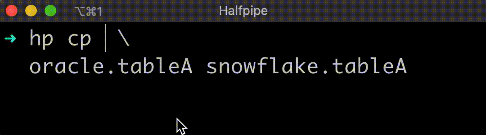

## [Halfpipe](https://halfpipe.sh)

Halfpipe is a command-line utility for streaming data to and from the following RDBMS types:

1. Oracle
1. Snowflake
1. S3 (okay it's not an RDBMS, but it can be a target below)
1. (Postgres & Teradata support pending <<< let me know if this would be useful to speed up your migrations)

Among other things it supports:

* Extracting snapshots periodically
* Extracting deltas periodically 
* Oracle Continuous Query Notifications to stream in real-time
* HTTP service to start/stop/launch jobs
* Automatic conversion of table metadata DDL


## tl;dr Features & Demos



* [Copy table snapshots](./demo-svg/cp-snapshot/README.md)
* [Copy table changes / deltas](./demo-svg/cp-deltas/README.md)
* [Rip an entire Oracle schema to Snowflake](./demo-svg/cp-full-schema/README.md) (contains sample commands)
* [Start a micro-service to keep a Snowflake table up-to-date](./demo-svg/service/README.md)
* [Synchronise table data from a source to target](./demo-svg/sync-batch/README.md)
* [Stream table changes in real-time](./demo-svg/sync-events/README.md)
* [Save the config file for a pipe action to run later](./demo-svg/pipes/README.md)
* [Configure connections to Oracle, Snowflake or S3](./demo-svg/connections/README.md)

More [sample commands](#sample-commands) are shown below.

```
$ hp
  ___ ___        .__   _____        __________.__
 /   |   \_____  |  |_/ ____\       \______   \__|_____   ____
/    ~    \__  \ |  |\   __\  ______ |     ___/  \____ \_/ __ \
\    Y    // __ \|  |_|  |   /_____/ |    |   |  |  |_> >  ___/
 \___|_  /(____  /____/__|           |____|   |__|   __/ \___  >
       \/      \/                                |__|        \/

Halfpipe is a DataOps utility for streaming data. It's designed to be light-weight and easy to use.
Use command-line switches for pre-canned actions or write your own pipes in YAML or JSON to sync
data in near real-time. Start an HTTP server to expose functionality via a RESTful API.
Half-Pipe is not yet cluster-aware but it scales out. Start multiple instances of this tool and
off you go. Happy munging! 😄

Usage:
  hp [command]

Available Commands:
  config      Configure connections and default flag values
  cp          Copy snapshots, deltas or metadata from source objects to target
  create      Generate helpful metadata
  pipe        Execute a transform described in a YAML or JSON file
  query       Run a SQL query against a configured connection
  serve       Start a web service and listen for pipe commands described in JSON
  sync        Sync objects from source to target using batch or event-driven modes
  user        Log in or out and show Halfpipe session details
  version     Show version information for Halfpipe
  help        Help about any command

Flags:
  -h, --help   help for hp

Use "hp [command] --help" for more information about a command.
```

## Usage & Deployment

Halfpipe is a light-weight Golang binary compiled against Oracle Database 19.5 Instant Client drivers (it's backwards compatible with older Oracle versions too). 

Choose *one* of these options to get going:

A) 

Use the [Get Started](#get-started) instructions below to build a local Docker image that contains the Halfpipe CLI and the Oracle client drivers. This is the easy option that drops you into a command prompt ready to use the `hp` tool or the [`configure.sh`](demo-svg/configure/README.md) script.

B) 

Download one of the Release binaries and add it to your target environment. You'll need the Oracle Instant Client installed and on your PATH.  If you get an error like `hp: error while loading shared libraries: libclntsh.so.19.1: cannot open shared object file: No such file or directory` ensure your ORACLE_HOME environment variable set and the OCI library is accessible.  If you follow Oracle's Instant Client set-up instructions and check that SQL*Plus works, you should be good to go. Run the `configure.sh` script to learn how to set up basic connections.

## Get Started

The following steps will walk through option A above to:-

1. add connections for an Oracle database, Snowflake and S3
1. create a Snowflake external stage compatible with Halfpipe
1. set default flag values for the `hp` CLI

After this, you'll be ready to use the example commands shown [below](#sample-commands) or in the [tl;dr section](#tldr-features--demos) above. 

Good luck and drop me an [email](#want-to-know-more-or-have-a-feature-request) if you run into any issues. Happy munging! 😄  

### Prerequisites

1. Docker
2. A valid profile entry in AWS CLI file `~/.aws/credentials` that can read/write an S3 bucket (by default this needs to be called "halfpipe" - notes on how to override it are below)
3. An S3 bucket that can be used as an external Snowflake stage
4. Oracle database connection details
5. Snowflake database connection details (please see the [`configure.sh`](demo-svg/configure/README.md) documentation to learn more if you're not using Snowflake)  

### Steps

```bash
# Build and start the Halfpipe Docker image with default AWS_PROFILE=halfpipe...

$ ./start-halfpipe.sh

# Once you're inside the Docker image, run this script to create connections
# and set default flag values:

$ ./configure.sh -c

$ # Follow the prompts and you're good to go.
```

* `start-halfpipe.sh` builds and starts a Docker image that contains the Halfpipe CLI and Oracle drivers. 
  By default it uses an `AWS_PROFILE` called "halfpipe" to supply IAM credentials.
  Use `-h` to see usage and the `-a` flag to override this.  
* `configure.sh -c` requests user input and runs basic set-up to create connections to Oracle, Snowflake and S3. 
  Here's an example [transcript](./demo-svg/configure/README.md). See the help output of [`configure.sh -h`](./demo-svg/configure/README.md#usage-of-configuresh) 
  to learn more about the `hp` commands required to create connections and set default flag values.  


## Sample Commands

Once you have connections setup, it's as simple as a single command to copy data snapshots or deltas between databases. 

Here are a few sample actions - the demos above cover them all in more detail.

Alternatively head over to https://halfpipe.sh/in-detail/#learn to see a set of short videos that explain some of the features. 

```bash
# copy a snapshot of all data from Oracle table DIM_TIME to Snowflake via S3...
hp cp snap oracle.dim_time snowflake.dim_time

# copy a snapshot of all data from Oracle table DIM_TIME to a S3 bucket connection...
hp cp snap oracle.dim_time demo-data-lake

# copy changes to Snowflake found in Oracle table DIM_TIME since the last time we looked
# repeat every hour...
# (SK_DATE is both the primary key and column that drives changes)
hp cp delta oracle.dim_time snowflake.dim_time -p sk_date -d sk_date -i 3600

# above we used a target connection called demo-data-lake for a S3 bucket - here's how to add it...
# more example of adding connections are in the Setup section below
hp config connections add s3 -c demo-data-lake -d s3://test.s3.reeslloyd.com

# copy a snapshot of all data from database OracleA, table DIM_TIME, to another Oracle database...
hp cp snap oracle.dim_time my-ora-connection.my_dim_time

# create a Snowflake STAGE called MYSTAGE to load data from S3 
# use -h for help or append -e to execute DDL...
hp create stage snowflake -s MYSTAGE

# synchronise all rows in source to target (make target data the same as source)...
hp sync batch oracle.dim_time snowflake.dim_time

# stream data from DIM_TIME to Snowflake in real-time... 
hp sync events oracle.dim_time snowflake.dim_time

# run a web service and listen for pipe actions in JSON/YAML...
# see the demos animations above for examples
hp serve 

# configure default flag values to save time having to supply them on the CLI...
hp config defaults -h

# configure database connections...
hp config connections -h

# explore the demos above to see how you can add other connection types...
# or perform more simple actions to move data quickly.
```


## Notes

* Default flag values are picked up from file `~/.halfpipe/config.yml`
* Database connections are stored in file `~/.halfpipe/connections.yaml`

These files are AES-256 encrypted and base64 encoded at rest.

Use the `config` CLI command to configure them.


## Limitations

* `hp sync events` does not work inside the Docker container fired up by `start-halfpipe.sh`... 
The issue is that Oracle expects to be able to notify the HalfPipe (`hp`) process using an 
open port. While the process appears to work and performs an initial table sync, 
it silently never receives further notifications events. 
Work around this when running the container on Linux by using host networking.
Alternatively, take the `hp` binary out of the container and use matching Oracle drivers directly
on a Linux host. 
* `hp sync events` will stream DML changes from source to target, but where >=100 rows
are committed per source transaction, it generates a full table re-sync as per the `hp sync batch`
command. This requires Oracle priv `GRANT CHANGE NOTIFICATION TO <user>` to work.
* `hp cp meta` doesn't produce ALTER TABLE statements yet. Drop the target table and recreate to 
work around this.


## Want to know more or have a feature request?

I'd welcome your feedback. 

Visit my website over at [halfpipe.sh](https://halfpipe.sh)

Get in touch by raising an issue above or email me directly at `richard at halfpipe dot sh`
